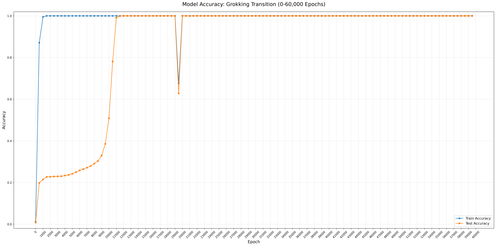
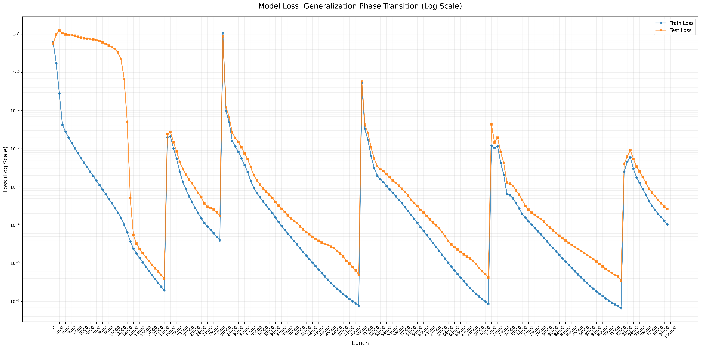
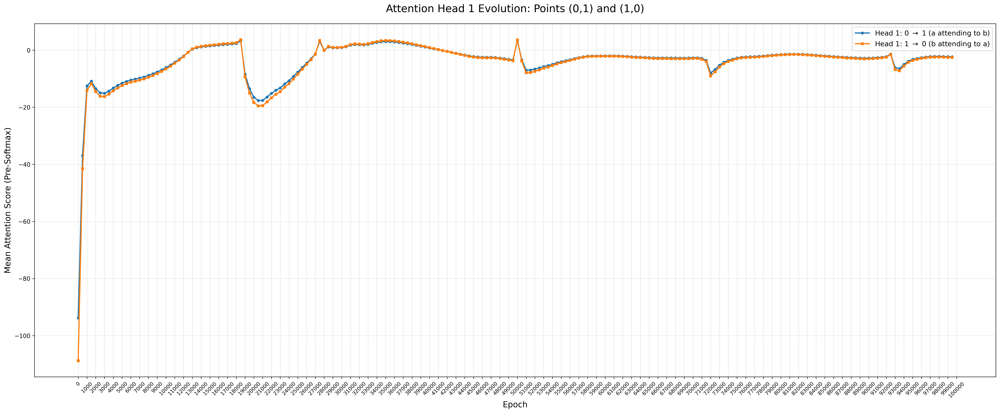

# Hypothesis

Following similar experimentation and setup of Neel Nanda's experimentation on generalisation and grokking, we check for (+) and (-) to see if the model generalises wth the positional embeddings.

This hypothesis, already proven by Neel Nanda about the model generalising to ignore positional embeddings, leads to another theory.

This theory states that there should be a relation between the attention scores between a and b and b and a if the model generalises to ignore positional embeddings, similarly for a and = and b and =, the same case should apply. 

This github Repo shows the experimentation followed by me towards this hypothesis.

While these above scenarios should be ideally followd by (+), it should be the exact opposite in (-) as positional embeddings play a major role in determining the answers in subtraction.

# Setup Details
| Term                 | Value |
|:--------------------:|-------:|
| embed_d              | 128   |
| att_d                | 128   |
| heads                | 4     |
| mlp_n                | 512   |
| non_linearity        | ReLu  |
|optimizer             | AdamW |
| lr                   | 0.001 |
| weight_decay         | 1     |

Minor changes in setup include not using similar embedding technique as Neel Nanda, used GPT styled embeddings (token embeddings + positional embeddings (derived similar to that from 'attention is all you need'.))

# Results

Accuracy graph

Loss graph

Avg. Attention value graph between a,b and b,a.

# Findings
 - Generalisation and grokking achieved after nearly 12,000 epochs.
 - Noticed a repition of loss values for both train and test spike high after every 19,000 intervals (need to know why this is happening).
 - Attention head values are showing sinusidial wave formations meaning that generalisation still occurs.
 - While the loss values are high, the avg. attention values of a,b and b,a still overlap each other (need to know why this is happening).

# Further Ablations to do
 - Check for other weight decay values

